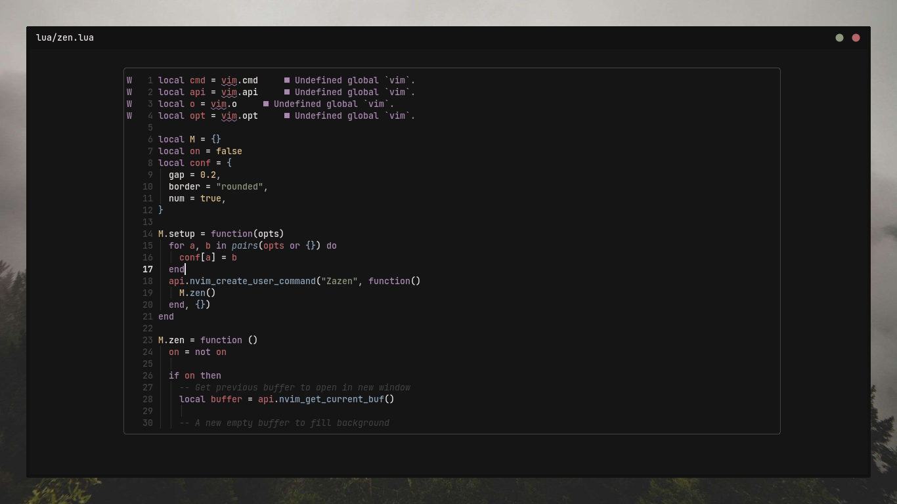

<h1 align="center">Zazen.nvim</h1>
<h4 align="center">A Zen Mode with Borders</h4>

<p align="center">
  <a href="https://github.com/Manas140/zazen.nvim/stargazers"></a>
  <a href="https://github.com/Manas140/zazen.nvim/issues"></a>
  <a href="https://github.com/Manas140/zazen.nvim/network/members"></a>
</p>

<p>
  
</p>

Zazen is a personalized Zen Mode to "cater my needs", and that's all.

## Features
- Zen Mode with borders
- Resizes automatically
- Splits appear below the window, hence it has main focus
- Configurable UI features [ numbers, gap & border ]

## Installation

- Packer

```lua
use 'Manas140/Zazen.nvim'
```

- Vim Plug 

```lua 
Plug 'Manas140/Zazen.nvim'
```

## Configuration 

- Use Default 

```lua 
require('zazen').setup()
```

- Configure 

```lua 
require("zazen").setup {
  num = [true|false] -- show numbers
  gap = [0.1-0.5], -- prefered to keep value under 0.5
  border = "[none|single|double|rounded]",
}
```

## Usage [ Toggle ]

```
:Zazen
```

## References

- [Flirt.nvim](https://github.com/tamton-aquib/flirt.nvim) [ for resize, move & close function ]
